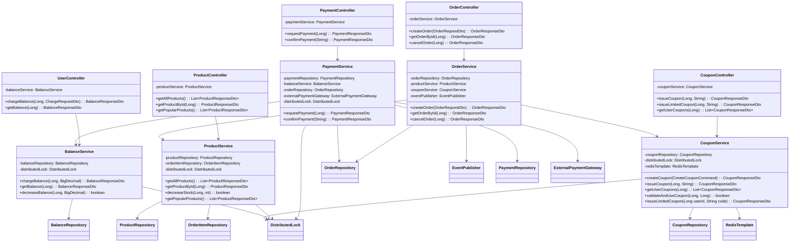

## ✅ 2. Service / Controller
> 프리젠테이션 계층과 애플리케이션 서비스 계층의 API 및 기능 흉름 정의

```mermaid
classDiagram
    class OrderController {
        -orderService: OrderService
        +createOrder(OrderRequestDto): OrderResponseDto
        +getOrderById(Long): OrderResponseDto
        +cancelOrder(Long): OrderResponseDto
    }

    class ProductController {
        -productService: ProductService
        +getAllProducts(): List~ProductResponseDto~
        +getProductById(Long): ProductResponseDto
        +getPopularProducts(): List~ProductResponseDto~
    }

    class UserController {
        -balanceService: BalanceService
        +chargeBalance(Long, ChargeRequestDto): BalanceResponseDto
        +getBalance(Long): BalanceResponseDto
    }

    class CouponController {
        -couponService: CouponService
        +issueCoupon(Long, String): CouponResponseDto
        +issueLimitedCoupon(Long, String): CouponResponseDto
        +getUserCoupons(Long): List~CouponResponseDto~
    }

    class PaymentController {
        -paymentService: PaymentService
        +requestPayment(Long): PaymentResponseDto
        +confirmPayment(String): PaymentResponseDto
    }

    class OrderService {
        -orderRepository: OrderRepository
        -productService: ProductService
        -couponService: CouponService
        -eventPublisher: EventPublisher
        +createOrder(OrderRequestDto): OrderResponseDto
        +getOrderById(Long): OrderResponseDto
        +cancelOrder(Long): OrderResponseDto
    }

    class PaymentService {
        -paymentRepository: PaymentRepository
        -balanceService: BalanceService
        -orderRepository: OrderRepository
        -externalPaymentGateway: ExternalPaymentGateway
        -distributedLock: DistributedLock
        +requestPayment(Long): PaymentResponseDto
        +confirmPayment(String): PaymentResponseDto
    }

    class ProductService {
        -productRepository: ProductRepository
        -orderItemRepository: OrderItemRepository
        -distributedLock: DistributedLock
        +getAllProducts(): List~ProductResponseDto~
        +getProductById(Long): ProductResponseDto
        +decreaseStock(Long, int): boolean
        +getPopularProducts(): List~ProductResponseDto~
    }

    class BalanceService {
        -balanceRepository: BalanceRepository
        -distributedLock: DistributedLock
        +chargeBalance(Long, BigDecimal): BalanceResponseDto
        +getBalance(Long): BalanceResponseDto
        +decreaseBalance(Long, BigDecimal): boolean
    }

    class CouponService {
        -couponRepository: CouponRepository
        -distributedLock: DistributedLock
        -redisTemplate: RedisTemplate
        +createCoupon(CreateCouponCommand): CouponResponseDto
        +issueCoupon(Long, String): CouponResponseDto
        +getUserCoupons(Long): List~CouponResponseDto~
        +validateAndUseCoupon(Long, Long): boolean
        +issueLimitedCoupon(Long userId, String code): CouponResponseDto
    }

    %% Service 간 의존관계 추가
    OrderController --> OrderService
    ProductController --> ProductService
    UserController --> BalanceService
    CouponController --> CouponService
    PaymentController --> PaymentService

    OrderService --> OrderRepository
    OrderService --> ProductService
    OrderService --> CouponService
    OrderService --> EventPublisher

    PaymentService --> PaymentRepository
    PaymentService --> BalanceService
    PaymentService --> OrderRepository
    PaymentService --> ExternalPaymentGateway
    PaymentService --> DistributedLock

    ProductService --> ProductRepository
    ProductService --> OrderItemRepository
    ProductService --> DistributedLock

    BalanceService --> BalanceRepository
    BalanceService --> DistributedLock

    CouponService --> CouponRepository
    CouponService --> DistributedLock
    CouponService --> RedisTemplate
```

---