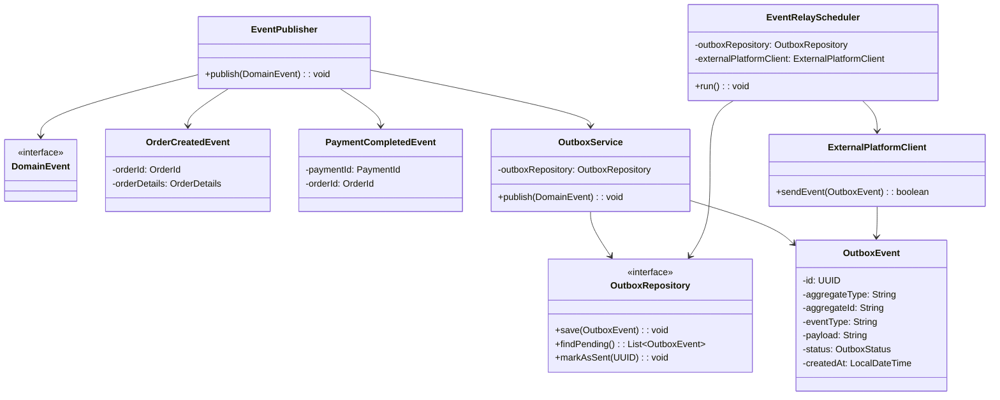

## 3. Outbox & Event 처리
> 이벤트 발행, 저장, 비동기 전송까지의 환경을 아웃벅스 구조와 같이 정리

```mermaid
classDiagram
    class EventPublisher {
        +publish(DomainEvent): void
    }

    class DomainEvent {
        <<interface>>
    }

    class OrderCreatedEvent {
        -orderId: OrderId
        -orderDetails: OrderDetails
    }
    class PaymentCompletedEvent {
        -paymentId: PaymentId
        -orderId: OrderId
    }

    class OutboxService {
        -outboxRepository: OutboxRepository
        +publish(DomainEvent): void
    }

    class OutboxRepository {
        <<interface>>
        +save(OutboxEvent): void
        +findPending(): List~OutboxEvent~
        +markAsSent(UUID): void
    }

    class OutboxEvent {
        -id: UUID
        -aggregateType: String
        -aggregateId: String
        -eventType: String
        -payload: String
        -status: OutboxStatus
        -createdAt: LocalDateTime
    }

    class EventRelayScheduler {
        -outboxRepository: OutboxRepository
        -externalPlatformClient: ExternalPlatformClient
        +run(): void
    }

    class ExternalPlatformClient {
        +sendEvent(OutboxEvent): boolean
    }

    EventPublisher --> DomainEvent
    EventPublisher --> OrderCreatedEvent
    EventPublisher --> PaymentCompletedEvent
    EventPublisher --> OutboxService
    OutboxService --> OutboxRepository
    OutboxService --> OutboxEvent
    EventRelayScheduler --> OutboxRepository
    EventRelayScheduler --> ExternalPlatformClient
    ExternalPlatformClient --> OutboxEvent
```