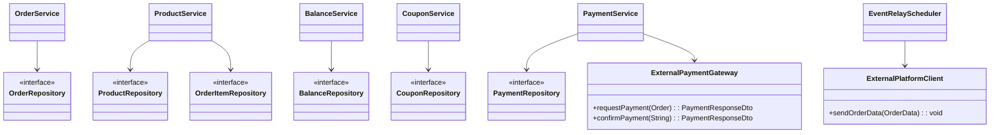

## ✅ 4. Infra Layer (Repository & External Integration)
> 도메인 저장소와 외부 시스템 연동 구조를 구분하여 표현합니다.

```mermaid
classDiagram
    %% Repository Interfaces
    class OrderRepository {
        <<interface>>
    }
    class OrderItemRepository {
        <<interface>>
    }
    class ProductRepository {
        <<interface>>
    }
    class BalanceRepository {
        <<interface>>
    }
    class CouponRepository {
        <<interface>>
    }
    class PaymentRepository {
        <<interface>>
    }

    %% External Clients
    class ExternalPaymentGateway {
        +requestPayment(Order): PaymentResponseDto
        +confirmPayment(String): PaymentResponseDto
    }
    class ExternalPlatformClient {
        +sendOrderData(OrderData): void
    }

    %% Infra Layer 관계
    OrderService --> OrderRepository
    ProductService --> ProductRepository
    ProductService --> OrderItemRepository
    BalanceService --> BalanceRepository
    CouponService --> CouponRepository
    PaymentService --> PaymentRepository
    PaymentService --> ExternalPaymentGateway
    EventRelayScheduler --> ExternalPlatformClient
```
