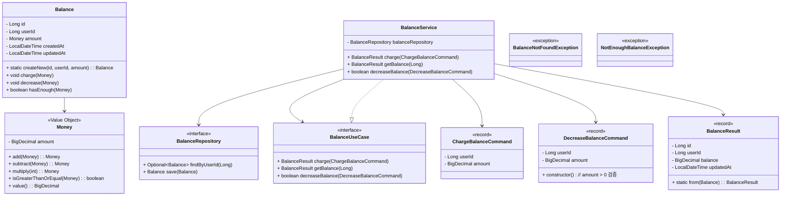

```mermaid
classDiagram
    class Balance {
        - Long id
        - Long userId
        - Money amount
        - LocalDateTime createdAt
        - LocalDateTime updatedAt
        + static createNew(id, userId, amount): Balance
        + void charge(Money)
        + void decrease(Money)
        + boolean hasEnough(Money)
    }

    class Money {
<<Value Object>>
- BigDecimal amount
+ add(Money): Money
+ subtract(Money): Money
+ multiply(int): Money
+ isGreaterThanOrEqual(Money): boolean
+ value(): BigDecimal
}

class BalanceService {
- BalanceRepository balanceRepository
+ BalanceResult charge(ChargeBalanceCommand)
+ BalanceResult getBalance(Long)
+ boolean decreaseBalance(DecreaseBalanceCommand)
}

class BalanceUseCase {
<<interface>>
+ BalanceResult charge(ChargeBalanceCommand)
+ BalanceResult getBalance(Long)
+ boolean decreaseBalance(DecreaseBalanceCommand)
}

class BalanceRepository {
<<interface>>
+ Optional~Balance~ findByUserId(Long)
+ Balance save(Balance)
}

class ChargeBalanceCommand {
<<record>>
- Long userId
- BigDecimal amount
}

class DecreaseBalanceCommand {
<<record>>
- Long userId
- BigDecimal amount
+ constructor() // amount > 0 검증
}

class BalanceResult {
<<record>>
- Long id
- Long userId
- BigDecimal balance
- LocalDateTime updatedAt
+ static from(Balance): BalanceResult
}

class BalanceNotFoundException {
<<exception>>
}

class NotEnoughBalanceException {
<<exception>>
}

%% 관계
BalanceService --> BalanceRepository
BalanceService --> BalanceUseCase
BalanceUseCase <|.. BalanceService
Balance --> Money
BalanceService --> ChargeBalanceCommand
BalanceService --> DecreaseBalanceCommand
BalanceService --> BalanceResult
```