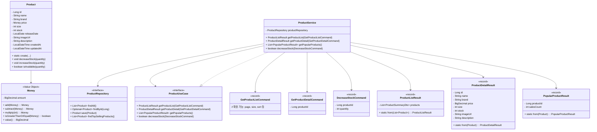

```mermaid
classDiagram
    class Product {
        - Long id
        - String name
        - String brand
        - Money price
        - int size
        - int stock
        - LocalDate releaseDate
        - String imageUrl
        - String description
        - LocalDateTime createdAt
        - LocalDateTime updatedAt
        + static create(...)
        + void decreaseStock(quantity)
        + void increaseStock(quantity)
        + boolean isAvailable(quantity)
    }

    class Money {
        <<Value Object>>
        - BigDecimal amount
        + add(Money): Money
        + subtract(Money): Money
        + multiply(int): Money
        + isGreaterThanOrEqual(Money): boolean
        + value(): BigDecimal
    }

    class ProductService {
        - ProductRepository productRepository
        + ProductListResult getProductList(GetProductListCommand)
        + ProductDetailResult getProductDetail(GetProductDetailCommand)
        + List~PopularProductResult~ getPopularProducts()
        + boolean decreaseStock(DecreaseStockCommand)
    }

    class ProductUseCase {
        <<interface>>
        + ProductListResult getProductList(GetProductListCommand)
        + ProductDetailResult getProductDetail(GetProductDetailCommand)
        + List~PopularProductResult~ getPopularProducts()
        + boolean decreaseStock(DecreaseStockCommand)
    }

    class ProductRepository {
        <<interface>>
        + List~Product~ findAll()
        + Optional~Product~ findById(Long)
        + Product save(Product)
        + List~Product~ findTopSellingProducts()
    }

    class GetProductListCommand {
        <<record>>
        // 확장 가능: page, size, sort 등
    }

    class GetProductDetailCommand {
        <<record>>
        - Long productId
    }

    class DecreaseStockCommand {
        <<record>>
        - Long productId
        - int quantity
    }

    class ProductListResult {
        <<record>>
        - List~ProductSummaryDto~ products
        + static from(List~Product~): ProductListResult
    }

    class ProductDetailResult {
        <<record>>
        - Long id
        - String name
        - String brand
        - BigDecimal price
        - int size
        - int stock
        - String imageUrl
        - String description
        + static from(Product): ProductDetailResult
    }

    class PopularProductResult {
        <<record>>
        - Long productId
        - int salesCount
        + static from(Product): PopularProductResult
    }

    %% 관계 설정
    ProductService --> ProductRepository
    ProductService --> ProductUseCase
    ProductUseCase <|.. ProductService
    Product --> Money
    ProductService --> GetProductListCommand
    ProductService --> GetProductDetailCommand
    ProductService --> DecreaseStockCommand
    ProductService --> ProductListResult
    ProductService --> ProductDetailResult
    ProductService --> PopularProductResult
a
```